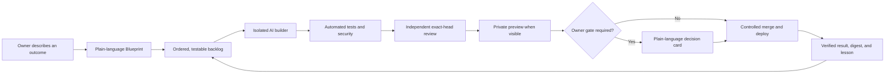
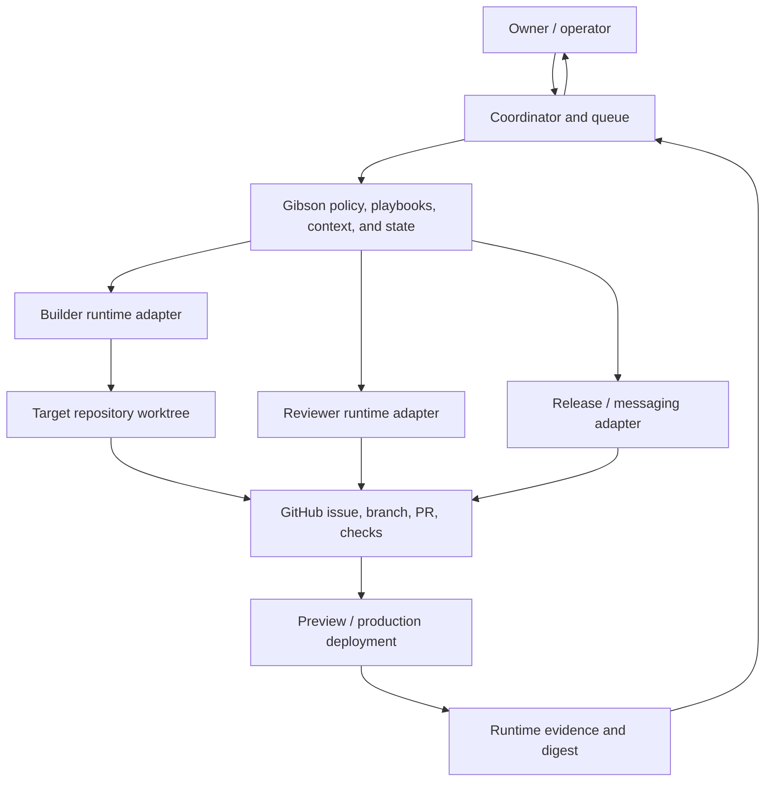
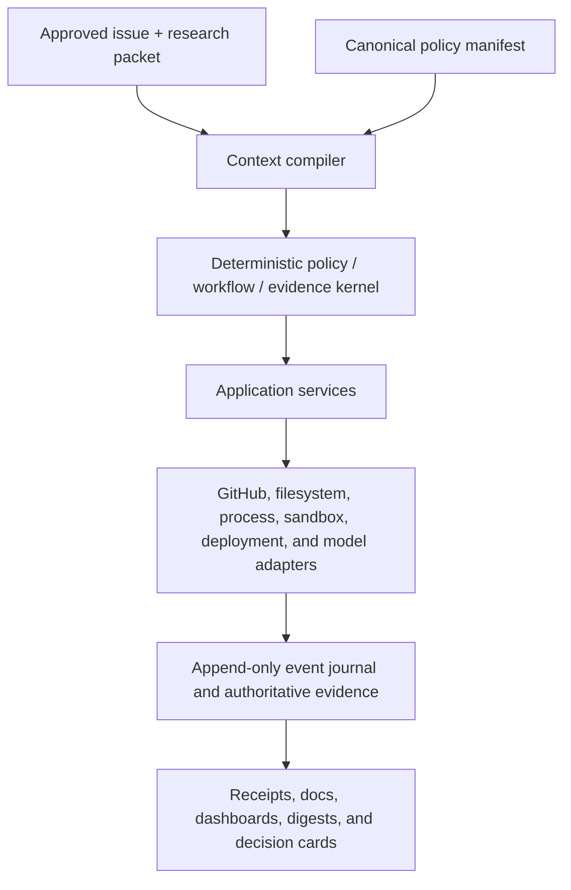

# The Gibson — How It Automates the Software Development Life Cycle

**A plain-language guide for owners, followed by the technical design for operators
and engineers.**

If you are a non-technical owner, read Part I and stop when you have what you need.
If you operate, audit, adopt, or extend the harness, continue through Parts II–IV.

> **Honest status:** The Gibson already ships doctrine, role playbooks, isolation
> and claim tools, deterministic gates, CI templates, review procedures, loop
> controls, vendor adapters, cost telemetry, and delivery-control audits. The
> complete promise — a non-technical owner repeatedly receiving production-quality
> software from an unattended loop — still requires the live canary and external
> operator proof tracked in [issue #96](https://github.com/The-AIE/the-gibson/issues/96)
> and [issue #18](https://github.com/The-AIE/the-gibson/issues/18). Architecture
> described as **roadmap** below is not represented as shipped enforcement.

---

## Part I — Human-readable explanation

### The one-sentence version

The Gibson is a portable operating system for software delivery: you describe an
outcome, AI workers turn it into small pieces of work, automatic checks and
independent reviewers verify those pieces, and only the few decisions that truly
belong to an owner are brought back to you.

The AI models are replaceable workers. The rules, evidence, and quality controls
belong to you.

### What The Gibson is — and is not

The Gibson is:

- a written contract every participating AI must follow;
- an automated assembly line for planning, coding, testing, reviewing, securing,
  merging, deploying, and learning;
- a set of scripts and CI checks that verify important facts instead of trusting an
  AI's confidence;
- a coordinator pattern that can spread work across Grok, Codex, Claude, Hermes, or
  other compatible runtimes;
- a safety system that keeps agents isolated, limits their authority, and stops at
  named human decisions;
- a memory and improvement loop that turns repeated failures into permanent tests,
  sensors, or clearer instructions.

The Gibson is not:

- a new coding model;
- a reason to let an agent bypass branch protection, security, or owner approval;
- a promise that every target repository is safe merely because Gibson files were
  copied into it;
- an automatic product owner that invents business goals or makes subjective
  commitments on your behalf;
- a replacement for GitHub, a deployment platform, or the coding runtimes. It
  governs how those systems are used.

### The experience for a non-technical owner

You should be able to interact with the whole system in ordinary language:

1. **Describe the outcome.**
   “I want customers to book appointments without calling me” is a valid work
   request. You do not need to translate it into frameworks, databases, or tickets.

2. **Answer business questions.**
   The planner asks who the feature is for, what success looks like, what must not
   happen, and what choices genuinely require your taste or authority.

3. **Approve a plain-language Blueprint.**
   The Blueprint explains what will change, what will not change, how success will
   be checked, and which decisions might return to you. This is the cheapest point
   to correct the direction.

4. **Let the crew work.**
   The system breaks the Blueprint into small, ordered tasks. Each coding worker
   receives its own isolated copy of the project and a bounded assignment.

5. **See evidence, not activity theatre.**
   Code must compile, pass tests, build, clear security checks, and receive an
   independent review. Visible changes are exercised on a private preview as a user
   would experience them.

6. **Receive only useful messages.**
   The operator interface has four shapes: status, decision card, intake question,
   and incident notice. Logs and stack traces stay with the technical layer.

7. **Approve the decisions only you can make.**
   New spending, destructive data changes, a first public launch, use of your
   identity, and other named gates wait safely for you. Unrelated work continues.

8. **Verify the result.**
   A release is not complete merely because code merged. The running deployment
   must match the expected commit and pass a smoke test.

9. **Make the system better.**
   Surprises and repeated failures become lessons. The best lessons become automated
   checks so the same class of mistake is less likely to recur.



### What “automates the SDLC” means

The software development life cycle, or **SDLC**, is the path from an idea to
software that is running safely. The Gibson gives each stage an input, an output,
and a gate:

| Stage | Plain-language purpose | Evidence produced |
|---|---|---|
| Plan | Agree on the outcome before paying to build it | Approved Blueprint with testable success criteria |
| Decompose | Turn the Blueprint into small, ordered jobs | Deduplicated GitHub issues with scope and risk |
| Build | Implement one bounded job without colliding with another worker | Isolated branch and pull request |
| Test | Prove each promised behavior and each bug fix | Executable tests tied to acceptance criteria |
| Review | Have a different mind look for defects | Exact-commit approve or request-changes verdict |
| UX evaluation | Exercise visible changes on a live preview | User-flow results, accessibility evidence, screenshots |
| Security | Check for secrets, vulnerable dependencies, authorization errors, and attack paths | Hard-fail checks plus explicit report-only findings |
| Merge | Admit only a fully evidenced change to the shared codebase | Protected, signed, reviewed merge |
| Deploy and verify | Prove the intended version is actually running | Deployment identity, ready state, production smoke test |
| Retro | Turn operational experience into a stronger harness | Lessons, sensors, playbook or policy improvements |

A stage can be inapplicable — a documentation change may not need a browser
preview — but the skip must be explicit. Confidence is never a substitute for a
gate.

### What the owner sees

The owner does not need to watch a terminal. The system translates technical state
into:

- **Status:** what shipped, what is being worked on, and whether anything needs you.
- **Decision card:** what decision is needed, why it belongs to you, the risk, the
  recommendation, what happens if you wait, and how to reply.
- **Intake question:** one business question at a time.
- **Incident notice:** what happened, the user impact, what was done, and whether
  you need to act.

Silence is safe: an unanswered decision never becomes automatic approval. The item
waits, while other eligible work continues.

### What the system handles without asking

Within an approved scope, the crew is expected to handle ordinary engineering
friction itself:

- failing tests and red CI;
- implementation choices that do not change the approved outcome;
- merge conflicts inside the claimed scope;
- reviewer requests for changes;
- flaky tooling and retryable infrastructure failures;
- missing or unclear technical documentation;
- bounded repair loops and rerouting to another capable worker.

The closed list of real interruptions is in
[docs/14-human-gates.md](docs/14-human-gates.md). It includes destructive changes,
money, outward-facing actions, owner identity, product-scope ambiguity, Tier C
merges, credentials, active exploitation, and prompt-injection incidents.

### How several AI systems work as one crew

The usual fleet has one persistent **coordinator** and several bounded **workers**:

- the coordinator knows the goal, the queue, current GitHub state, merge order, and
  owner decisions;
- a builder receives one self-contained task and implements it in an isolated
  worktree;
- a reviewer from a different vendor reads the exact proposed commit without write
  authority;
- a release role independently checks the evidence, merges in order, verifies the
  deployment, and cleans up;
- a messaging runtime can deliver summaries and decision cards without becoming a
  coding or review authority.

One current operating example is **Grok for high-volume implementation, Codex for
read-only exact-head review, and Claude for a final release check**. That is a
routing choice, not a permanent vendor requirement. The harness should continue to
work when the names or economics change.

Workers do not need to talk to one another. The coordinator passes each worker a
bounded brief, and workers return artifacts and evidence. Git, GitHub, tests, and
the run journal carry durable state.

### Why this can use AI tokens efficiently without lowering quality

The Gibson optimizes **cost per verified result**, not the fewest possible tokens.

- Deterministic scripts answer deterministic questions before a model is called.
- High-volume, testable implementation goes to a flat-rate or high-capacity pool
  that clears the quality floor.
- Stronger and scarcer reasoning is reserved for architecture, hard debugging,
  security, product judgment, and high-risk review.
- Different vendor pools are used for implementation and evaluation when available,
  both to distribute quota and to reduce shared failure modes.
- Each worker receives a small context capsule instead of the full history of the
  project.
- Retries are bounded. Repeating the same prompt after the same failure is forbidden;
  the next attempt must add evidence, escalate, or park.
- A review, test result, or cache entry is reusable only for the same exact commit.

The full operator procedure is
[playbooks/token-efficiency.md](playbooks/token-efficiency.md).

### What happens when the crew gets stuck

The default ladder is:

1. **Self-heal:** retry or repair a mechanical problem within a fixed budget.
2. **Enrich:** give the next attempt the failing check, relevant diff, and exact
   acceptance criterion.
3. **Reroute or escalate:** use a worker with the next required capability grade.
4. **Park:** preserve the branch, evidence, and handoff after bounded attempts.
5. **Ask only when it is an owner decision:** translate the blocker into a decision
   card and keep draining unrelated work.

Unattended does not mean unbounded. The loops have retry limits, no-progress
detection, maximum iterations, a local and remote halt system, and fail-closed paths
for uncertain authority.

### One model or a fleet

The Gibson supports two operating shapes:

- **Single-platform / solo loop:** one runner cycles through fresh role contexts and
  file handoffs. A separate model or vendor is still preferred for review; Tier C
  remains human-gated.
- **Multi-model fleet:** a coordinator assigns disjoint work to several vendor
  pools, with cross-vendor review and one serialized merge train.

The non-technical product promise does not require the owner to manage several
models. Multiple models are an implementation and quality upgrade behind the
interface, not extra work for the owner.

---

## Part II — Technical explanation

### System boundary

The Gibson is the **delivery control plane**. It governs work performed in a target
repository but does not replace the target's application code, GitHub, CI,
deployment provider, or model runtime.



Portable policy and orchestration live in Gibson. A target repository keeps the
thin enforcement needed to protect its own code: an agent contract, CI jobs,
application-specific tests, security configuration, deployment metadata, and any
local policy overrides.

### Sources of truth and durable artifacts

Models can summarize state, but summaries are not authoritative. The important
state is bound to durable artifacts:

| Concern | Authoritative or durable artifact |
|---|---|
| Product intent | Approved Blueprint / plan |
| Work contract | Current GitHub issue body and acceptance criteria |
| Dependency and readiness | Issue links, labels, current code/history evidence |
| Ownership | GitHub claim label plus remote claim ledger |
| Isolation | One worktree, branch, and issue per mutating lane |
| Proposed change | Pull request head commit SHA and diff |
| Build quality | Baseline-relative local gate plus CI on that exact SHA |
| Review | Independent verdict bound to reviewer identity and exact SHA |
| Visible behavior | Preview URL bound to the proposed revision, user-flow evidence |
| Security | Hard-fail scan results and explicit inferential findings |
| Delivery | Merge SHA, deployment identity/state, runtime smoke result |
| Recovery | Loop state, previous validated state, journal, parked handoff |
| Learning | Versioned lessons, decisions, incidents, and harness changes |
| Resource use | Append-only cost-ledger events when usage is measured |

An agent saying “done,” “green,” or “reviewed” is a claim. The coordinator or release
role derives the underlying Git/GitHub/deployment facts again.

### The ten-stage state flow

#### 0. Plan

**Entry:** owner outcome, product brief, or standing approved goal.
**Executor:** planner.
**Output:** Blueprint with problem, users, scope, non-scope, risks, design intent,
and numbered acceptance criteria.
**Gate:** human approval of product direction.

The plan specifies outcomes and observable constraints. It should not prescribe
every implementation detail the builder is qualified to choose.

#### 1. Decompose

**Entry:** approved Blueprint.
**Executor:** decomposer.
**Output:** deduplicated, dependency-ordered, mergeable issues with risk tier,
estimated file scope, acceptance criteria, and owner gates.
**Gate:** contract/decomposition validation and overlap review.

Before dispatch, shipped code and the live backlog must be checked so an agent does
not build a duplicate feature from a stale issue.

#### 2. Build

**Entry:** unblocked, unclaimed issue.
**Executor:** builder.
**Output:** isolated branch and pull request.
**Gate:** baseline-relative green gate.

Mutation never occurs in the canonical checkout. The lane is:

```text
one issue → one authoritative claim → one worktree → one branch → one pull request
```

Deliberate slices are allowed only when the scopes do not overlap.

#### 3. Test

**Entry:** implementation claiming to satisfy the issue.
**Executor:** test engineer; independent for high-risk work.
**Output:** executable criterion coverage and regression tests.
**Gate:** tests pass and promised behaviors are mapped to checks.

The test-integrity ratchet also rejects silent reductions in test count or increases
in skipped/todo tests unless an exact, visible waiver matches the real delta.

#### 4. Review

**Entry:** green pull request.
**Executor:** different agent; cross-vendor by default when available.
**Output:** `APPROVE` or `REQUEST_CHANGES`, bound to the exact head SHA.
**Gate:** valid independent verdict and resolved findings.

Review lenses cover correctness, security, consent/PII, money, performance, and
maintainability. A new commit invalidates an older review. A missing reviewer or
unknown review identity fails closed.

#### 5. UX evaluation

**Entry:** user-visible change with a live preview.
**Executor:** evaluator who did not build the change.
**Output:** exercised flows, screenshots, accessibility and visual evidence.
**Gate:** acceptance flows and applicable accessibility/visual thresholds pass.

The evaluator tests the running preview, not a prose description of the code.

#### 6. Security

**Entry:** every pull request; deeper treatment for higher risk.
**Executor:** deterministic CI plus security reviewer.
**Output:** secret, static-analysis, supply-chain, authorization, dynamic,
AI-surface, and runtime findings.
**Gate:** hard-fail layers pass; report-only findings receive owners and follow-up.

Tier C surfaces — authentication, money, consent/PII, security boundaries, schema,
and production data — require frontier-grade adversarial review and a human merge
gate.

#### 7. Merge

**Entry:** current head is green, independently approved, and free of unmet gates.
**Executor:** release role.
**Output:** reviewed merge on the protected integration path.
**Gate:** exact-head checks, acceptance evidence, sign-off/DCO, review independence,
and any required owner approval.

The merge train is serialized. The release role re-reads live state immediately
before merge because an earlier green snapshot can become stale.

#### 8. Deploy and verify

**Entry:** merged revision and healthy delivery-control path.
**Executor:** release role plus deployment adapter.
**Output:** verified running revision.
**Gate:** deployment is for the expected commit, reaches the required ready state,
and passes post-deploy smoke checks.

CI proves properties of a commit. It does not prove that the expected commit is
running, that the production branch is wired correctly, or that the live service
works.

#### 9. Retro

**Entry:** completed and failed runs, review rounds, incidents, and telemetry.
**Executor:** historian.
**Output:** lessons and candidate harness improvements.
**Gate:** repeated or surprising failure becomes durable doctrine or, preferably, a
deterministic sensor.

Self-improvement proposes changes; it does not grant those changes extra authority.
Harness changes still pass through the same issue, review, merge, and owner gates.

### Coordination, isolation, and claims

#### One coordinator, bounded workers

The coordinator owns sequencing and live truth. Workers are cold-startable and
disposable. Each dispatch includes:

- repository and isolated worktree path;
- issue and exact acceptance contract;
- role, risk tier, allowed file scope, and forbidden actions;
- relevant lessons and canonical references;
- required checks and output contract;
- current base/head identities when applicable.

Workers return a diff, test output, review verdict, or research packet. They do not
become merge authority merely by producing the artifact.

#### Worktree isolation

Every writer operates in a separate Git worktree. This prevents uncommitted file
collisions. The canonical checkout remains read-only. Dependencies that create
mutable state should also be installed per worktree.

Worktrees stop physical overwrites; they do not stop two agents from implementing
the same idea in different files. Claims stop that logical race.

#### Authoritative claims

The claim model combines GitHub-visible ownership and a versioned remote ledger.
Admission, overlap checks, release, reaping, and cleanup must use fresh authoritative
inventory and fail closed when it cannot be obtained.

Important invariants include:

- one issue cannot be silently owned by two ordinary lanes;
- an open pull request protects a claim from automated reaping;
- legacy and current claim representations are treated as one inventory during
  migration;
- scope overlap is checked, not inferred from issue numbers alone;
- stale-claim cleanup requires positive evidence and compare-and-swap behavior;
- cleanup never derives an unverified path or falls back to broad recursive deletion;
- claim removal, branch/worktree cleanup, label changes, and success comments must
  not report a completed state when any authoritative step is incomplete.

Mutating WIP is limited (normally three lanes per target). Read-only research and
review can parallelize more freely. Hot files such as schemas and dependency
manifests are serialized or de-hot by generation.

### Context loading and prompt architecture

Context is treated as an input to compile, not a transcript to dump.

#### Current pattern

1. Load the root `AGENTS.md`, local override, target contract, and relevant lessons.
2. Inspect the repository and task surface before selecting deep guidance.
3. Use a compact map to find the canonical document for the task.
4. Load the vertical role playbook and only the relevant source files.
5. Bind the acceptance criteria, file scope, risk tier, and evidence requirements
   into the worker brief.

Horizontal knowledge — rules that apply to most tasks — belongs in an always-visible,
compact `AGENTS.md` retrieval map. Vertical procedures — builder, reviewer, release,
security, and other action-specific workflows — remain skills and playbooks.

#### Roadmap pattern

The context-compiler design in
[issue #166](https://github.com/The-AIE/the-gibson/issues/166) will generate a
versioned, provenanced task capsule and least-capability tool manifest from the
canonical policy model, repository map, issue contract, research packet, and exact
source snapshot. It is intended to:

- disclose optional detail progressively;
- carry source digests and freshness boundaries;
- reject missing, stale, contradictory, or oversized context;
- keep secrets out of prompts;
- record context/tool metrics for replay and evaluation.

This is roadmap design. Today, the coordinator and playbooks assemble much of that
context procedurally.

Gibson proposes an ablation over no index, default skill discovery, explicit
inspect-then-retrieve, a compact `AGENTS.md` index, and a compiled capsule under
[issue #159's](https://github.com/The-AIE/the-gibson/issues/159) evaluation
requirements: held-out, repeated, matched-budget trials. This prevents one favorable
benchmark from becoming doctrine without local evidence.

The immediate research signal is
[Vercel's January 2026 Next.js evaluation](https://vercel.com/blog/agents-md-outperforms-skills-in-our-agent-evals):
its framework-specific task set reported 53% for both the no-doc baseline and a
default-discovery skill, 79% when the agent was explicitly told to inspect the
project before invoking the skill, and 100% with a compressed 8 KB `AGENTS.md`
retrieval index. Gibson uses that result to justify an ablation, not to claim that
the 100% result generalizes to other repositories or tasks.

### Model routing and token load balancing

Every task receives a capability grade before a vendor is chosen:

| Grade | Work shape | Typical use |
|---|---|---|
| G — Grind | High volume; deterministic sensors catch most wrong answers | Mechanical implementation, test scaffolding, research sweeps, loop iterations |
| S — Skilled | Multi-file reasoning; some failure remains inferential | Tier B builds, integration debugging, normal review and UX evaluation |
| F — Frontier | Judgment-heavy; failure may be expensive or invisible | Architecture, product planning, security adversarial review, incidents, Tier C evaluation |

Routing then considers the available quota pool:

- flat-rate or high-capacity pools absorb volume;
- capped subscriptions reserve headroom for skilled and frontier work;
- metered calls are used only when the task needs that capability;
- review prefers a different vendor than the author at the required grade;
- deterministic checks remain scripts rather than model calls.

Generation may be inexpensive; evaluation may not be underpowered. Tier B/C
evaluation has a higher capability floor than routine generation.

The retry ladder is bounded:

```text
attempt
  → same criterion fails twice
  → enrich once with concrete evidence
  → third failure
  → escalate one capability grade
  → repeated frontier failure
  → park and improve the contract or harness
```

When runtimes report usage, `scripts/cost-ledger.sh` records runner, pool, role, wall
time, issue/PR/iteration, and aggregate tokens or vendor units when actually known.
Missing numbers remain unknown; the harness never invents prices or token counts.

### Quality and evidence binding

#### Baseline-relative green gate

The lane records its branch-point baseline before mutation. Before each commit it
runs the target's generate, typecheck, lint, unit-test, and build commands. Zero new
failures are allowed relative to the trusted baseline.

The same class of checks runs in CI. Local success improves iteration speed; CI is
the shared enforcement layer.

#### Exact-head invariant

Evidence is valid only for the pull request's current head SHA:

- required checks must exist and pass for that SHA;
- the review verdict must name that SHA;
- preview and evaluation evidence must correspond to that revision;
- a push invalidates older review and may invalidate preview evidence;
- immediately before merge, the release role re-fetches the live head and required
  check set.

A missing check is not a pass. A successful workflow that skipped a required job is
not equivalent to required evidence.

#### Independent review

The author cannot approve its own work. Independence includes:

- different actor or fresh isolated evaluator context;
- read-only capability over the reviewed head;
- observed identity and configuration;
- verdict bound to the exact commit;
- no ability to mutate the evidence being graded.

Cross-vendor review is the default because it adds different training and tool
failure modes. Single-platform mode is a documented degradation using a distinct
model/fresh context; it does not weaken Tier C owner gates.

#### Risk-shaped depth

- **Tier A:** routine, isolated, standard gates and one independent review.
- **Tier B:** shared or multi-file behavior, full review lenses and applicable UX
  evaluation.
- **Tier C:** money, auth, consent/PII, security boundaries, schema, or production
  data; frontier adversarial review, serialized stateful work, and human approval.

Risk may increase when the actual diff expands. It does not silently decrease
because a builder labeled the issue optimistically.

### UX, security, and runtime verification

User-visible changes are evaluated against a live preview:

- contract flows are clicked through end to end;
- screenshots and visual comparisons are retained;
- accessibility checks run;
- design and behavior are evaluated by someone other than the builder.

Security is layered:

1. secret scanning;
2. static application analysis;
3. dependency and supply-chain checks;
4. authentication/authorization matrix and IDOR checks;
5. dynamic scanning against a preview;
6. adversarial security reasoning;
7. prompt-injection and AI-surface controls;
8. runtime posture.

Some layers hard-fail immediately. Report-only layers must remain visible and have a
promotion plan; “report-only” must not be rendered as “green.”

After merge, runtime verification is a separate evidence class. The reference
deployment path is Vercel, but the contract is portable: identify the exact deployed
revision, wait for a healthy state, execute smoke flows, and observe the release
window.

### Merge and delivery control

The release role checks the change. Delivery control checks the door through which
the change reaches production.

A target must declare its real delivery model:

- **main is production:** merging `main` is effectively a deploy approval;
- **release branch:** `main` integrates, while a protected production branch is
  promoted deliberately;
- **tag or pinned revision:** production advances only when the approved pin moves.

Branches that can reach production require live protection, strict required checks,
review, stale-review dismissal, force-push prevention, and any applicable deployment
environment approval. Documentation that says “release branch” while the provider
actually deploys `main` is a failed audit, not a harmless mismatch.

Delivery-control mutation defaults to dry-run and remains subject to owner gates.
Secret rotation, destructive schema work, billing, first public launches, and
permission changes are never inferred from a routine release instruction.

### Loop execution and recovery

#### Solo loop

`scripts/loop.sh` cycles role hats through fresh contexts. Durable state includes:

- current issue, PR, role, next role, round, parked state, and next action;
- a last-known-valid state snapshot;
- an append-only journal;
- failure, stale/no-progress, escalation, and maximum-iteration budgets.

State is validated before it is trusted. Corruption restores exact prior bytes when
possible; it never silently invents defaults. A runner that exits zero but changes
nothing substantive is counted as no progress.

#### Fleet mode

The coordinator dispatches disjoint lanes and keeps one merge train. It monitors
live PR/check/deployment state, applies claim and WIP rules, and redispatches bounded
repair prompts. A worker never polls or merges merely because it finished coding.

#### Halt and degraded operation

The loop supports:

- an on-box halt file or environment stop;
- remote GitHub label and sentinel-file stops;
- a persistent halt latch so a transient API failure does not accidentally resume a
  previously confirmed stop;
- bounded failure and no-progress budgets;
- parked handoffs when a lane cannot safely continue.

Uncertainty about authority reduces capability. It never expands it.

### Observability, receipts, and the ratchet

Current evidence is distributed across GitHub, CI, the deployment provider, loop
state/journal, claim files, lessons, and the cost ledger. The release role must join
those facts before claiming success.

The portable delivery-receipt design in
[issue #160](https://github.com/The-AIE/the-gibson/issues/160) will project one
verifiable record containing the issue/contract, context and capability digests,
exact code head, checks, independent review, merge, deployment, cleanup, cost, and
terminal disposition. Until that lands, PR comments and run artifacts are evidence,
not a single canonical receipt.

The historian evaluates:

- cycle time and owner minutes per shipped change;
- gate and review failure classes;
- repair rounds and parked work;
- quality escapes and runtime incidents;
- token or vendor-unit use when known;
- context size, tool use, and unnecessary retrieval as those metrics become
  available.

Repeated failure should move left into a deterministic check. Controls can be
strengthened from evidence; weakening authority remains an explicit decision.

---

## Part III — Current implementation versus roadmap

### What exists now

| Capability | Current state |
|---|---|
| Cross-runtime agent contract | Root `AGENTS.md` plus local and target overrides |
| Ten-stage doctrine and nine role contracts | `docs/` and `playbooks/` |
| Claim/worktree isolation | Scripts, ledger files, GitHub labels, overlap sensors |
| Green gate and test-integrity controls | Local scripts and portable CI template |
| Solo unattended loop controls | State validation, budgets, no-progress sensor, halt paths, handoffs |
| Multi-model coordinator pattern | Documented and exercised through fleet operations |
| Vendor portability | Adapters for Claude, Codex, Grok, Hermes, Goose, and Devin |
| Token-routing procedure | Capability grades, pool routing, bounded retry, cost ledger |
| UX/security/release procedures | Playbooks, CI templates, preview/runtime checks |
| Delivery-control audit | Branch/deployment truth checks with dry-run hardening path |
| Non-technical presentation contract | Four message shapes, decision cards, Ask Contract |
| Improvement memory | Lessons, decisions, incidents, historian/retro doctrine |

“Exists” does not mean every target has installed or enforced it. Adoption must
verify the target's live CI, branch protection, deployment wiring, identities, and
runtime behavior.

### What remains to prove or build

| Gap | Design owner |
|---|---|
| Live owner-controlled branch/environment/reviewer protections | [#140](https://github.com/The-AIE/the-gibson/issues/140) |
| Unattended end-to-end self-dogfood canary | [#96](https://github.com/The-AIE/the-gibson/issues/96) |
| External non-technical operator proof | [#18](https://github.com/The-AIE/the-gibson/issues/18) |
| Canonical policy manifest and generated doctrine views | [#164](https://github.com/The-AIE/the-gibson/issues/164) |
| Research packets and dispatch readiness | [#167](https://github.com/The-AIE/the-gibson/issues/167) |
| Deterministic context compiler and tool budget | [#166](https://github.com/The-AIE/the-gibson/issues/166) |
| Formal workflow state machine and append-only event journal | [#158](https://github.com/The-AIE/the-gibson/issues/158) |
| Portable exact-head delivery receipt | [#160](https://github.com/The-AIE/the-gibson/issues/160) |
| Typed kernel/runtime boundary and replaceable ports | [#162](https://github.com/The-AIE/the-gibson/issues/162) |
| Architecture fitness, matched-budget evaluation, and drift gates | [#159](https://github.com/The-AIE/the-gibson/issues/159) |

The umbrella design and dependency order live in
[architecture epic #165](https://github.com/The-AIE/the-gibson/issues/165).
It uses a strangler migration: current behavior remains authoritative until a
reviewed replacement proves equivalence and has a rollback path.

### Target control-plane architecture

The roadmap separates deterministic authority from replaceable I/O:



The kernel will decide policy, transitions, invariants, and evidence validity without
network or model calls. Adapters will request effects and report observations. No
runtime, provider, generated prose, or benchmark result will be allowed to redefine
policy or manufacture authority.

---

## Part IV — Operating and adoption reference

### Repository map

| Need | Start here |
|---|---|
| Non-technical owner onboarding | [VIBECODING.md](VIBECODING.md) |
| Technical quick start | [QUICKSTART.md](QUICKSTART.md) |
| Day-to-day operator manual | [GUIDE.md](GUIDE.md) |
| Agent-wide contract | [AGENTS.md](AGENTS.md) |
| Reading order by audience | [docs/00-INDEX.md](docs/00-INDEX.md) |
| Stage contracts | [docs/02-sdlc-pipeline.md](docs/02-sdlc-pipeline.md) |
| Role contracts | [docs/03-roles.md](docs/03-roles.md) |
| Claims and worktrees | [docs/05-concurrency.md](docs/05-concurrency.md) |
| Quality and review gates | [docs/06-quality-gates.md](docs/06-quality-gates.md) |
| Security | [docs/08-security.md](docs/08-security.md) and [SECURITY-AUDIT.md](SECURITY-AUDIT.md) |
| Solo loop | [docs/11-solo-loop.md](docs/11-solo-loop.md) |
| Deployment | [docs/12-vercel.md](docs/12-vercel.md) |
| Adoption | [docs/13-adoption.md](docs/13-adoption.md) |
| Human gates | [docs/14-human-gates.md](docs/14-human-gates.md) |
| Model economics | [docs/15-model-economics.md](docs/15-model-economics.md) |
| Non-technical operation | [docs/16-nontechnical-operation.md](docs/16-nontechnical-operation.md) |
| Multi-model orchestration | [docs/20-multi-model-orchestration.md](docs/20-multi-model-orchestration.md) |
| Operator readiness | [docs/21-operator-readiness.md](docs/21-operator-readiness.md) |
| Delivery control | [docs/23-delivery-control.md](docs/23-delivery-control.md) |
| Token efficiency | [playbooks/token-efficiency.md](playbooks/token-efficiency.md) |
| Scripts and CI | [scripts/README.md](scripts/README.md) and [ci/README.md](ci/README.md) |
| Vendor adapters | [adapters/README.md](adapters/README.md) |

### Adoption ladder

Adoption is not a switch:

1. **Rung 1 — governed delivery:** install the target agent contract and CI gate.
   Coordination remains interactive, but all workers follow the same rules and
   checks.
2. **Rung 2 — unattended loop:** enable backlog-driven execution only after the
   adoption audit, delivery controls, error budgets, halt paths, review route, and
   live canary are proven.

An adopted target must define:

- its generate/typecheck/lint/test/build commands;
- risk-specific security and UX checks;
- hot files and local policy overrides;
- branch and production delivery model;
- required checks and reviewer identity;
- preview and runtime verification paths;
- owner decision and halt channels.

### Technical success criteria

The system can claim the end goal only after observed evidence shows:

- a non-technical owner can start and steer work without a terminal;
- an approved outcome becomes an implementation-ready, deduplicated queue;
- builders work unattended in isolated lanes;
- every shipped change has exact-head checks and independent review;
- applicable UX and security gates run on the real preview;
- owner-only decisions arrive as understandable cards and safe silence;
- the merge/deployment path is live-audited and cannot be bypassed casually;
- the deployed revision is identified and smoke-tested;
- a complete run can be replayed from durable evidence;
- cost, interventions, failures, cleanup, and lessons are reported truthfully;
- an external operator can repeat the flow without the system's authors guiding
  every step.

### Short glossary

| Term | Meaning |
|---|---|
| Agent / worker | An AI runtime performing one bounded role |
| Coordinator | The persistent process that owns sequencing and live truth |
| Blueprint | Approved human-readable product plan |
| Claim | Authoritative declaration that a lane owns an issue and file scope |
| Worktree | Separate working copy that prevents writers from overwriting each other |
| Pull request / PR | Proposed branch change with review and check evidence |
| Head SHA | Exact immutable commit currently proposed by the PR |
| Green gate | Required generate/typecheck/lint/test/build sequence |
| Exact-head review | Review whose verdict is valid only for the named commit |
| Tier A/B/C | Increasing risk and required evaluation depth |
| Human gate | One of the closed-list decisions that an agent cannot self-approve |
| Decision card | Plain-language owner request with recommendation and safe-wait behavior |
| Context capsule | Bounded, provenanced task knowledge supplied to a worker |
| Delivery control | Live protection of branches and paths that can reach production |
| Receipt | Verifiable record joining contract, code, checks, review, deploy, and cleanup |
| Ratchet | Turning operational lessons into stronger permanent controls |

---

The practical promise is simple: the owner supplies intent and authority; AI workers
supply implementation; deterministic sensors and independent reviewers supply
evidence; the release path supplies controlled delivery; and the ratchet makes the
next run better than the last.
