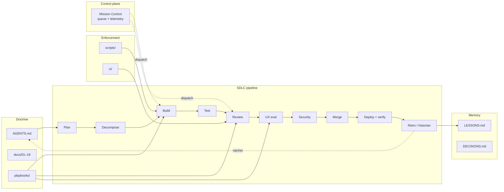

# The Gibson

**The open source harness for vibecoders.**

A portable, self-improving SDLC harness for agent fleets: describe what you want in
plain language, and the fleet plans, builds, tests, reviews, and ships it under gates
you can audit.

> **Start here, based on who you are:**
> - 🙂 **"I'm not technical — I just want software built."** Read
>   [VIBECODING.md](VIBECODING.md). It's the only page you need, and it has no jargon.
>   Wondering what you'd even build? [Five real examples](EXAMPLES.md).
> - 🔧 **"I run the fleet."** [QUICKSTART.md](QUICKSTART.md) then [GUIDE.md](GUIDE.md).
> - 🍴 **"I want to fork this for my own team."** Read
>   [docs/18-fork-and-upstream.md](docs/18-fork-and-upstream.md) — customize in
>   `local/`, keep getting upstream improvements.
> - 🤖 **"I'm an agent."** Load [AGENTS.md](AGENTS.md). That's the only mandatory contract; `docs/` is on-demand.
> - 📚 **Reading order by audience:** [docs/00-INDEX.md](docs/00-INDEX.md) ·
>   [FAQ.md](FAQ.md) · [docs/00-glossary.md](docs/00-glossary.md)
>
> Everything in this repo follows one interaction rule, the **Ask Contract**:
> whenever the system asks a human for anything, it says *what it's asking, what
> it does, why, and the risks* — in plain language, with every technical term
> explained. If any doc here fails that standard, that's a bug: open an issue.

Point it at any repo. Give it a well-scoped plan. The fleet decomposes the plan into
issues, builds, tests, reviews, security-scans, UI/UX-grades against live deployments,
and ships to Vercel — and does not stop unless a human gate requires it. Every failure
that happens twice becomes a permanent improvement to the harness itself.

> *"Agent = Model + Harness."* The model is rented. The harness is yours, and it
> compounds. — after [Fowler, Harness Engineering](https://martinfowler.com/articles/harness-engineering.html)

Named for the supercomputer in *Hackers* (1995). You don't hack The Gibson.
The Gibson hacks the backlog.

## What it is

The Gibson is a **doctrine + tooling repo** that gets installed into target projects.
It is deliberately **agent-agnostic**: the canonical harness is plain Markdown, shell
scripts, and GitHub Actions — things every runtime (Claude Code, OpenAI Codex, Grok,
Hermes, pi) can read and every CI can enforce. Vendor-specific ergonomics (Claude
skills, Codex configs, Grok loop drivers) are thin adapters over the same core.

Three layers:

| Layer | What | Where |
|---|---|---|
| **Doctrine** | Rules, roles, gates, playbooks every agent follows | `AGENTS.md`, `docs/`, `playbooks/` |
| **Enforcement** | Deterministic gates that don't care who wrote the code | `ci/`, `scripts/`, target-repo CI |
| **Memory** | Versioned lessons, decisions, incidents — the self-improvement substrate | `memory/` |

The Gibson is the **harness**. [Mission Control](https://github.com/mrhinkle/mission-control)
remains the **runtime control plane** (task queue, telemetry, cross-vendor dispatch).
They compose: Mission Control decides *who* works; The Gibson decides *how* they work.

## The pipeline at a glance

```
PLAN ─▶ DECOMPOSE ─▶ BUILD ─▶ TEST ─▶ REVIEW ─▶ UI/UX EVAL ─▶ SECURITY ─▶ MERGE ─▶ DEPLOY ─▶ RETRO
 │         │           │        │        │          │            │          │         │        │
 spec +    GitHub      worktree green    multi-lens Playwright   SAST/DAST/ human     Vercel   lessons →
 design    issues w/   + scope  gate     tiered,    vs. preview  authz/     gate on   promote  harness
 language  contracts   claims            x-vendor   deployment   secrets    Tier C    + verify PRs
```



| Piece | Job |
|---|---|
| Roles | planner · decomposer · builder · test-engineer · reviewer · ux-evaluator · security · release · historian — [docs/03](docs/03-roles.md) |
| Stores | Gibson `memory/` (durable) + MC memory table (runtime) — [docs/09](docs/09-memory-and-self-improvement.md) |
| MC | Who works; Gibson = how they work |

Full detail: [docs/02-sdlc-pipeline.md](docs/02-sdlc-pipeline.md)

## Core principles (the short version)

1. **Guides + Sensors.** Feedforward controls steer agents before they act (docs,
   conventions, scaffolds); feedback controls catch and correct after (linters, tests,
   review agents). Both are harness artifacts, both are improvable.
2. **Never grade your own homework.** Generation and evaluation are separate agents,
   ideally separate vendors. Evaluators are tuned to skepticism and verify against
   *running software*, not diffs.
3. **Primitives, not features.** A minimal core any runtime can execute; everything
   else is an extension. (After pi.dev.)
4. **The ratchet.** A failure that happens twice is a harness bug, not a model bug.
   It must become a new guide or sensor — often authored by the agent that hit it.
5. **Agent-agnostic core, vendor-thin edges.** If a rule only works in one vendor's
   runtime, it isn't doctrine yet.
6. **Autonomy by default, human gates by exception.** Agents do not stop to ask
   permission for reversible work inside a claimed scope. The complete list of
   mandatory stops fits on one page: [docs/14-human-gates.md](docs/14-human-gates.md).

## Documentation map

| Doc | Contents |
|---|---|
| [QUICKSTART.md](QUICKSTART.md) | Fastest path: clone → first adopted repo (Ask Contract steps) |
| [FAQ.md](FAQ.md) | Common questions from the first month of operation |
| [docs/00-INDEX.md](docs/00-INDEX.md) | Reading order by audience |
| [docs/00-glossary.md](docs/00-glossary.md) | One-line definitions of Gibson terms |
| [AGENTS.md](AGENTS.md) | **Agents start here.** The operational contract every agent loads first |
| [docs/01-principles.md](docs/01-principles.md) | Design principles and the research they came from |
| [docs/02-sdlc-pipeline.md](docs/02-sdlc-pipeline.md) | The full pipeline, stage by stage, with gates |
| [docs/03-roles.md](docs/03-roles.md) | The development team: nine roles, their contracts and handoffs |
| [docs/04-plan-to-issues.md](docs/04-plan-to-issues.md) | Decomposing a plan into well-scoped issues with sprint contracts |
| [docs/05-concurrency.md](docs/05-concurrency.md) | Worktrees, scope claims, hot files, lane limits |
| [docs/06-quality-gates.md](docs/06-quality-gates.md) | The green gate, review tiers, and lens system |
| [docs/07-uiux-evaluation.md](docs/07-uiux-evaluation.md) | Playwright-vs-deployment UI/UX grading |
| [docs/08-security.md](docs/08-security.md) | The eight-layer security testing system |
| [docs/09-memory-and-self-improvement.md](docs/09-memory-and-self-improvement.md) | Memory substrate and the self-correcting loop |
| [docs/10-vendor-adapters.md](docs/10-vendor-adapters.md) | Running the harness on Claude Code / Codex / Grok / Hermes |
| [docs/11-solo-loop.md](docs/11-solo-loop.md) | Single-platform continuous mode (one agent, e.g. Grok, runs the whole loop) |
| [docs/12-vercel.md](docs/12-vercel.md) | Deployment doctrine: previews, promotion, schema safety |
| [docs/13-adoption.md](docs/13-adoption.md) | Installing The Gibson into a target repo |
| [docs/14-human-gates.md](docs/14-human-gates.md) | The only reasons an agent may stop |
| [docs/15-model-economics.md](docs/15-model-economics.md) | Which model for which task: G/S/F grades, flat-rate-first, escalation ladder |
| [docs/16-nontechnical-operation.md](docs/16-nontechnical-operation.md) | Operator tier: chat-only interface, decision cards, the never-stuck ladder |
| [docs/17-deployment-optimization.md](docs/17-deployment-optimization.md) | Inspecting & optimizing the deployment target: rendering, caching, cost, field vitals |
| [docs/18-fork-and-upstream.md](docs/18-fork-and-upstream.md) | Fork it, customize in `local/`, keep receiving upstream updates; contribute back |
| [docs/19-product-and-mcp.md](docs/19-product-and-mcp.md) | Chatterbuilt Foreman: the productized tier + the guided-setup MCP design |
| [docs/22-devin-cloud-supervisor.md](docs/22-devin-cloud-supervisor.md) | Local runners build; a Devin cloud session reviews, opens the PR, and merges |
| [GUIDE.md](GUIDE.md) | **Mark's operator manual** — start work, approve gates, run the loop, tune the harness |
| [VIBECODING.md](VIBECODING.md) | **The for-dummies guide** — vibecoding for non-technical owners, zero jargon |
| [HOW-IT-WORKS.md](HOW-IT-WORKS.md) | **What it is & how it works** — readable by anyone, actionable for everyone |
| [SECURITY-AUDIT.md](SECURITY-AUDIT.md) | Living security audit: threat model, eight-layer status, residual risks, checklists |
| [docs/DOC-BACKLOG.md](docs/DOC-BACKLOG.md) | Documentation build-out queue |
| [docs/examples/](docs/examples/) | Worked PLAN→issues, UX eval, authz matrix samples |
| [docs/troubleshooting/](docs/troubleshooting/) | Loop, claims, preview URL, ZAP, visual flake |
| [playbooks/](playbooks/) | Role dispatch prompts + adopt/loop |
| [scripts/](scripts/) | claim, gate, loop, posture, upstream-sync, … |
| [ci/](ci/) | Reusable workflow templates |
| [adapters/](adapters/) | Claude Code / Codex / Grok / Hermes runners + Devin cloud supervisor setup |
| [ROADMAP.md](ROADMAP.md) | Build-out phases from doctrine to full automation |

## Provenance

Synthesized from five sources, credited throughout:

- **ConferenceOS** (`mrhinkle/conference-os`) — the battle-tested mechanics: worktree
  isolation, scope claims, green gate, tiered review, schema safety, Vercel guard.
- **Mission Control** (`mrhinkle/mission-control`) — cross-vendor dispatch, task
  queue, shared runtime memory, "route by task class, not loyalty."
- **[Fowler — Harness Engineering](https://martinfowler.com/articles/harness-engineering.html)** —
  guides/sensors, computational vs. inferential controls, the self-correcting loop.
- **[Anthropic — Harness design for long-running agents](https://www.anthropic.com/engineering/harness-design-long-running-apps)** —
  planner/generator/evaluator separation, sprint contracts, Playwright evaluation,
  context resets via file handoffs, frontend design language at plan time.
- **[pi.dev](https://pi.dev/)** and **[ruvnet](https://github.com/ruvnet)** — primitives-not-features,
  self-modifying extensions, multi-host adapters, versioned memory substrates.

## License

Apache License 2.0 — Copyright 2026 Mark Hinkle. Fork it, customize it, run it
(see [docs/18-fork-and-upstream.md](docs/18-fork-and-upstream.md)); contributions
back are welcome through the same pipeline the harness uses on itself.
