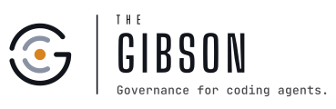

# The Gibson

{: width="360" }

**The governance harness for your coding agents.**

Your AI development crew, with rules.

You describe what you want in plain words. A team of AI agents plans it, builds
it, tests it, security-checks it, and ships it to your live site — and only
interrupts you for decisions that genuinely belong to the owner: money, going
live, and customer data.

> 🙂 **In plain English:** this project is a rulebook and toolkit that makes AI
> coding agents work like a disciplined construction crew instead of an
> unsupervised intern. It's free, open source, and it gets smarter every time
> it makes a mistake.

## Pick your door

| You are… | Start with |
|---|---|
| **A business owner** — no tech background needed | [The friendly guide](VIBECODING.md), then [five real examples](EXAMPLES.md) |
| **Ready to try it** | [Quickstart](QUICKSTART.md) — every step explained with what/why/risks |
| **Running a fleet** | [The operator's manual](GUIDE.md) |
| **Forking for your own team** | [Fork & upstream](docs/18-fork-and-upstream.md) |
| **An AI agent** | [AGENTS.md](AGENTS.md) — your contract |
| **Just curious how it works** | [Reading order](docs/00-INDEX.md) · [FAQ](FAQ.md) · [Glossary](docs/00-glossary.md) |

## The goal

The Gibson is a capable, autonomous software engineering harness. You give it an
outcome. Agents plan the work, write the code, test it, and ship it. A different
agent reviews every change, from a different vendor when one is available.
Nothing merges without passing tests and a security scan, and changes users can
see get tested in a real browser. The crew stops for you on [sixteen
conditions](docs/14-human-gates.md), such as spending money, going live, or
touching customer data. It handles the rest. When it makes a mistake, the fix
goes into the rules.
